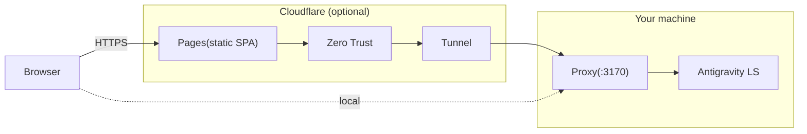

# Porta

[](https://github.com/L1M80/porta/actions/workflows/ci.yml)
[](LICENSE)


Remote web interface for [Antigravity](https://antigravity.google/) Agent Manager.  
Access your local Antigravity sessions from your phone, tablet, or any remote browser through a lightweight LSP bridge.

Porta is a two-part system: a **proxy** that bridges your local Antigravity Language Server to the network, and a **web UI** (installable PWA) that gives you a mobile-friendly chat interface.

<p align="center">
  
</p>

<p align="center">
  
</p>

## Quick start

**Prerequisites**: **[Node.js](https://nodejs.org/) ≥ 22**, **[pnpm](https://pnpm.io/) ≥ 10**, and a running
[Antigravity](https://antigravity.google/) instance.

> **Warning:** Porta is a bridge to Antigravity. If Antigravity is not
> running, the proxy will start but cannot connect to any session.

```bash
git clone https://github.com/L1M80/porta.git
cd porta
pnpm install
cp .env.example .env   # edit if needed — see comments inside
pnpm dev               # proxy (:3170) + web (:5173)
```

Open `http://localhost:5173` in your browser.

### LAN access

To access from another device on your home network:

```bash
# Set PORTA_HOST to this machine's LAN IP in .env
PORTA_HOST=192.168.1.23
```

Devices on the same network can reach the proxy at `http://192.168.1.23:3170`.  
Wildcard binds (`0.0.0.0`, `::`) and public IPs are rejected at startup for safety.

> **Note:** to also access the Vite dev UI from LAN, start it with `--host`:
>
> ```bash
> pnpm --filter @porta/web dev -- --host
> ```

## Why Porta?

There are several ways to access a local development environment
remotely. Here's how Porta compares:

| Approach                              | Data sent           | Bandwidth      | Latency                   | Mobile UX                    | Self-hosted |
| ------------------------------------- | ------------------- | -------------- | ------------------------- | ---------------------------- | ----------- |
| **Screen sharing** (VNC, RDP, Parsec) | Pixel stream        | High           | Noticeable                | Poor: tiny text, no touch UX | ✅          |
| **SSH + port forwarding**             | Raw TCP             | Low            | Low                       | No UI: terminal only         | ✅          |
| **Cloud IDE** (Codespaces, Gitpod)    | Full workspace      | N/A (cloud)    | Varies                    | Usable but heavy             | ❌          |
| **Porta**                             | Structured LSP data | **Negligible** | **Real-time** (WebSocket) | **Native PWA**               | ✅          |

Porta doesn't stream pixels or run your workspace in the cloud. It
relays structured conversation data through the Antigravity Language
Server Protocol, so you get:

- **Near-zero bandwidth**: JSON messages, not video frames
- **Real-time streaming**: WebSocket push, no polling lag
- **Native mobile experience**: [installable PWA](docs/pwa.md) with touch-optimized UI
- **Full privacy**: your code and conversations never leave your machine
- **No vendor lock-in**: self-hosted, MIT-licensed, works with any Antigravity installation

## Limitations

Porta is a **chat interface**, not a full remote IDE. These
constraints are inherent to its LSP-bridge architecture:

- **Antigravity must be running**: Porta is a bridge, not a
  standalone tool. No Antigravity instance → no data.
- **Bounded by Antigravity**: Porta can only expose what the
  Antigravity Language Server provides. If Antigravity doesn't support
  a feature, Porta can't offer it either.
- **No code editing or terminal**: Porta relays conversation-level
  data only. Use your local editor or SSH for file operations.
- **Single user**: The proxy connects to one local Antigravity
  Language Server. There is no multi-user or multi-tenant model.

### Platform support

| Tier       | Platform    | Status                                               |
| ---------- | ----------- | ---------------------------------------------------- |
| **Tier 1** | Linux (x64) | Developed and tested on real hardware                |
| **Tier 2** | Windows     | Tested on real hardware; less extensively than Linux |
| **Tier 3** | macOS       | CI passes; no real-hardware testing by maintainers   |

> Porta's proxy must run on the **same side** as Antigravity. If
> Antigravity runs on your Windows host, run Porta from PowerShell / cmd,
> **not** from inside WSL2. Conversely, if Antigravity runs inside WSL2,
> run Porta from WSL2, **not** from Windows. The two environments cannot
> see each other's processes.

## Remote access with Cloudflare



- **Local-only mode** (Quick start above): Browser → Proxy → LS. No cloud services needed.
- **Remote mode**: Cloudflare Pages + Tunnel + Zero Trust for secure remote access without exposing your network.

Cloudflare can be used in two different ways:

### Option A: Quick Tunnel (temporary testing)

If you only want to try Porta remotely and do not need a stable hostname, use a
Cloudflare Quick Tunnel.

- No custom domain required
- Best for demos and short-lived testing
- Not recommended for ongoing use: the hostname is temporary, and Cloudflare documents Quick Tunnels as testing-only infrastructure

To avoid stale copy-pasted instructions, follow Cloudflare's current docs:

- [Quick Tunnels](https://developers.cloudflare.com/cloudflare-one/networks/connectors/cloudflare-tunnel/do-more-with-tunnels/trycloudflare/)
- [Cloudflare Tunnel setup](https://developers.cloudflare.com/tunnel/setup/)

Use a named tunnel instead if you want a stable `VITE_API_BASE`, a fixed Cloudflare
Pages deployment, or long-lived remote access.

### Option B: Named tunnel + Pages (recommended for regular remote use)

This is the stable pattern for ongoing remote access. It requires:

- A **Cloudflare** account
- **Cloudflare Tunnel** (`cloudflared`) installed and authenticated
- A **Cloudflare Pages** project (for hosting the static SPA)
- A domain managed by **Cloudflare** for the tunnel hostname
- Optionally, **Cloudflare Zero Trust** for authentication

### 1. Configure `.env`

Set the proxy runtime and Cloudflare-related variables in `.env`:

```bash
# .env
PORTA_CORS_ORIGINS=https://<YOUR_PAGES_DOMAIN>
PORTA_TUNNEL_NAME=<YOUR_TUNNEL_NAME>
PORTA_CF_PROJECT=<YOUR_PROJECT_NAME>
```

### 2. Create the named tunnel

Point the tunnel at your local proxy:

```bash
cloudflared tunnel create <YOUR_TUNNEL_NAME>
cloudflared tunnel route dns <YOUR_TUNNEL_NAME> <YOUR_API_SUBDOMAIN>
```

### 3. Create `.env.production`

Create `.env.production` in the repo root for the web build:

```bash
# .env.production
VITE_API_BASE=https://<YOUR_API_SUBDOMAIN>
```

### 4. Build and deploy the SPA

```bash
pnpm deploy
```

This uses `PORTA_CF_PROJECT` from `.env`. If you prefer, you can run the
equivalent `wrangler pages deploy` command manually.

### 5. Start the proxy + named tunnel

```bash
pnpm dev:cloud
```

This reads `PORTA_TUNNEL_NAME` from `.env` and starts the proxy and
`cloudflared tunnel run` together.

### 6. Securing your API with Cloudflare Access (Zero Trust)

Exposing your local API to the public internet can be dangerous. To completely lock down your setup, you should protect **both** your frontend and your API using Cloudflare Access. 

Porta's built-in Edge Proxy securely bridges the two by injecting Machine-to-Machine authentication tokens, completely hiding your backend from the internet.

To set this up, follow these precise steps:

**1. Create Two Separate Applications**
In your **Cloudflare Zero Trust** dashboard, under **Access > Applications**, you must create **two** distinct applications:
- **Frontend App**: Protects your Pages deployment (e.g., `https://<YOUR_PAGES_DOMAIN>`). Configure this with standard user login policies (e.g., email OTP).
- **Backend API App**: Protects your Tunnel (e.g., `https://<YOUR_API_SUBDOMAIN>`). 

**2. Generate Service Tokens**
1. Navigate to **Access > Service Auth**.
2. Create a new Service Token for Porta. This will generate a **Client ID** and **Client Secret**.

**3. Add the Service Auth Policy to the Backend API**
1. Open the **Backend API App** you created in Step 1.
2. Go to the **Policies** tab and add a new policy.
3. Set the action to **Service Auth**.
4. In the rules, configure it to **Include > Service Token** and select the token you just created.

**4. Configure Cloudflare Pages Environment Variables**
1. Go to your **Cloudflare Pages** dashboard for `<YOUR_PROJECT_NAME>`.
2. Under **Settings > Environment variables**, add the following **three** variables to **both Production and Preview** environments:
   - `PORTA_API_BASE`: Set this to your exact API URL (e.g., `https://<YOUR_API_SUBDOMAIN>`).
   - `CF_ACCESS_CLIENT_ID`: The Client ID from Step 2.
   - `CF_ACCESS_CLIENT_SECRET`: The Client Secret from Step 2.

**5. Route Frontend Traffic Through the Proxy**
By default, the Porta frontend tries to fetch the API directly. To force it to use the secure Edge Proxy:
1. In your `.env.production` file, **remove or comment out** `VITE_API_BASE`. 
2. Without `VITE_API_BASE`, the frontend falls back to relative paths (`/api/*`), routing traffic through the Cloudflare Pages Edge proxy.
3. Run `pnpm deploy` again.

> **Backwards Compatibility Note:** If `VITE_API_BASE` is defined, the frontend will bypass the proxy entirely and attempt to communicate directly with the backend. This is fully supported and recommended for local development (LAN access) or deployments where the backend is not protected by Cloudflare Access. Additionally, the proxy will gracefully skip Service Token injection if the `CF_ACCESS_CLIENT_ID` environment variables are missing.

## Contributing

See [CONTRIBUTING.md](CONTRIBUTING.md) for development workflow, branch
strategy, and PR guidelines.

## Security

To report a vulnerability, see [SECURITY.md](SECURITY.md).

## License

[MIT](LICENSE)
